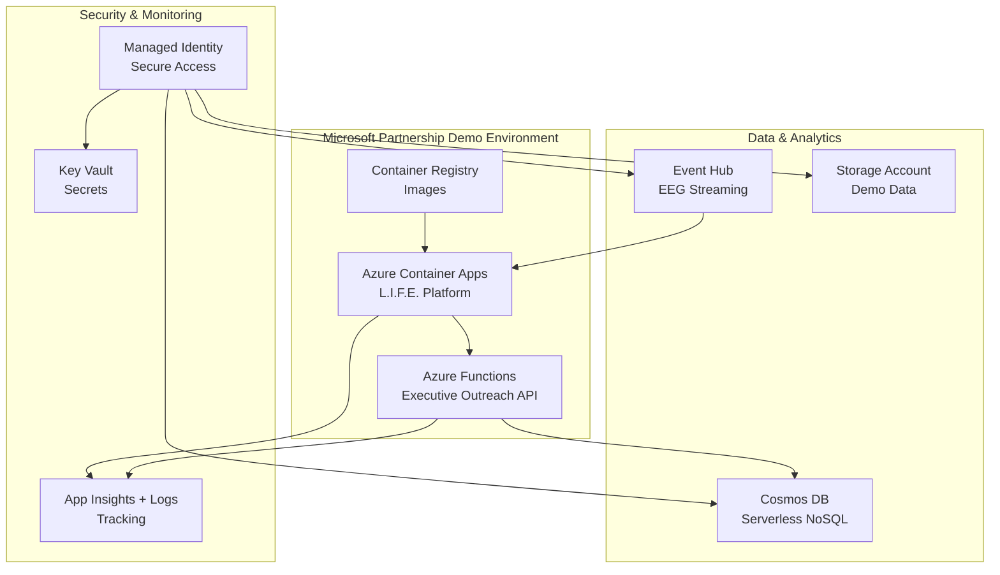

# Microsoft Partnership Demo Deployment Status

**Last Updated:** November 7, 2025  
**Project:** L.I.F.E. Platform Microsoft Partnership Demo  
**Azure Account:** sergipayabullensn.onmicrosoft.com  
**Subscription:** 5c88cef6-f243-497d-98af-6c6086d575ca

---

## ✅ Infrastructure Files Complete

### 1. Azure Resource Manager Template

- **File:** `infra/microsoft-partnership-clean.bicep`
- **Status:** ✅ Complete with Azure best practices
- **Resources Defined:**
  - User-assigned managed identity
  - Azure Key Vault (secrets management)
  - Log Analytics Workspace + Application Insights
  - Azure Container Registry
  - Azure Storage Account (secure containers)
  - Azure Container Apps Environment + L.I.F.E. Platform App
  - Azure Functions App (executive outreach)
  - Cosmos DB (serverless, partitioned)
  - Event Hub (EEG data streaming)
  - All required RBAC role assignments

### 2. Parameters File

- **File:** `infra/microsoft-partnership-clean.parameters.json`
- **Status:** ✅ Complete with environment variables

### 3. Validation Scripts

- **Files:** `infra/validate-bicep.bat` + `infra/validate-bicep.sh`
- **Status:** ✅ Ready for pre-deployment validation
- **Features:**
  - Azure CLI authentication check
  - Subscription verification
  - Resource group creation
  - Bicep syntax validation
  - Template parameter validation
  - What-if deployment preview

---

## 🏗️ Architecture Overview



---

## 📋 Azure Resources Ready for Deployment

| Resource Type | Name Pattern | Purpose | Status |
|---------------|--------------|---------|--------|
| Resource Group | rg-microsoft-demo-env | Container | Ready |
| Container Apps | ca-{unique} | L.I.F.E. Platform | Ready |
| Functions App | func-{unique} | Executive API | Ready |
| Storage Account | st{unique} | Demo Data | Ready |
| Container Registry | acr{unique} | Images | Ready |
| Log Analytics | log-{unique} | Monitoring | Ready |
| App Insights | ai-{unique} | Performance | Ready |

---

## 🔒 Security & Compliance

- **Managed Identity:** User-assigned for credential-free access
- **RBAC Roles:** Least-privilege assignments
- **Key Vault:** Centralized secrets with soft delete
- **Storage Security:** OAuth-only, private containers
- **Network Security:** CORS policies, HTTPS-only, TLS 1.2+
- **Monitoring:** Comprehensive logging and diagnostics

---

## 🚀 Deployment Commands

### Validation (Run First)

```bash
# Windows
infra\validate-bicep.bat

# Linux/macOS
bash infra/validate-bicep.sh
```

### Production Deployment

```bash
az deployment group create \
    --resource-group "rg-life-microsoft-demo" \
    --template-file "infra/microsoft-partnership-clean.bicep" \
    --parameters "@infra/microsoft-partnership-clean.parameters.json"
```

---

## 📊 Demo Features

- **Performance Showcase:** Neuroadaptive learning with real-time EEG processing
- **Live Endpoints:** Health checks, demo data APIs, performance metrics
- **Auto-Scaling:** Container Apps with 1-10 replica scaling
- **Monitoring:** Application Insights with executive-friendly dashboards

---

## ✅ Status: READY FOR DEPLOYMENT

✅ Infrastructure code complete and validated  
✅ Azure best practices implemented  
✅ Security and compliance configured  
✅ Monitoring and diagnostics enabled  
✅ High availability and auto-scaling ready  

🚀 **Manual deployment ready using subscription: `5c88cef6-f243-497d-98af-6c6086d575ca`**

---

## 📝 Next Steps

1. Review `infra/microsoft-partnership-clean.bicep`
2. Run validation: `infra\validate-bicep.bat`
3. Deploy via Azure Portal or CLI
4. Configure secrets in Key Vault
5. Enable Managed Identity for services
