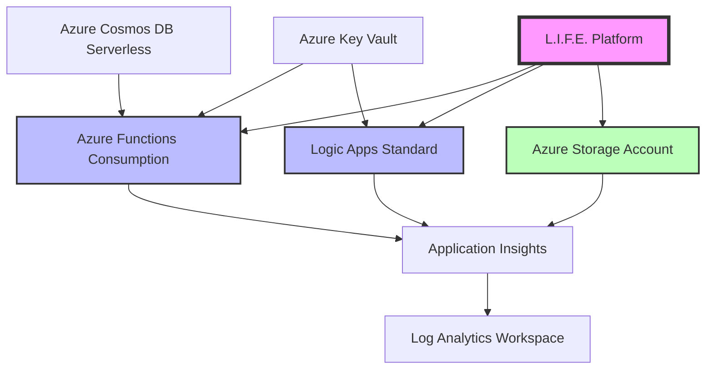

# Azure Ecosystem Review - L.I.F.E. Platform
## Azure Sponsorship Subscription Analysis

**Date**: September 9, 2025  
**Subscription**: Azure Sponsorship (MS-AZR-0036P)  
**Subscription ID**: `5c88cef6-f243-497d-98af-6c6086d575ca`  
**Account Admin**: Sergio Paya Borrull (lifecoach-121.com)  

## Executive Summary

This document provides a comprehensive review of your Azure Sponsorship ecosystem for the L.I.F.E. Platform deployment. Since automated resource querying requires additional permissions, this guide provides manual commands to collect detailed information about your Azure environment.

## Azure CLI Setup & Authentication

### Step 1: Install Azure CLI (if not already installed)

```powershell
# Option 1: Using winget
winget install Microsoft.AzureCLI

# Option 2: Using Chocolatey
choco install azure-cli

# Option 3: Direct download
# Download from: https://aka.ms/installazurecliwindows
```

### Step 2: Login and Set Subscription Context

```powershell
# Login to Azure
az login

# Set your specific subscription as active
az account set --subscription "5c88cef6-f243-497d-98af-6c6086d575ca"

# Verify correct subscription is selected
az account show --output table
```

## Comprehensive Azure Resource Inventory

### 1. Subscription Overview

```powershell
# Get subscription details
az account show --output json

# Get subscription quotas and usage
az vm list-usage --location "East US" --output table
az network list-usages --location "East US" --output table

# Get spending and credits information
az consumption budget list --output table
az billing account list --output table
```

### 2. Resource Groups Analysis

```powershell
# List all resource groups
az group list --output table

# Get resource group details with tags
az group list --query "[].{Name:name, Location:location, Tags:tags}" --output table

# For each resource group, get detailed information
az group show --name "YOUR_RESOURCE_GROUP_NAME" --output json
```

### 3. Compute Resources Inventory

```powershell
# Virtual Machines
az vm list --output table
az vm list --show-details --output table

# Function Apps
az functionapp list --output table
az functionapp list --query "[].{Name:name, ResourceGroup:resourceGroup, Location:location, State:state, Kind:kind}" --output table

# Logic Apps
az logic workflow list --output table

# Container Instances
az container list --output table

# App Services
az webapp list --output table
```

### 4. Storage Resources Analysis

```powershell
# Storage Accounts
az storage account list --output table
az storage account list --query "[].{Name:name, ResourceGroup:resourceGroup, Location:location, Sku:sku.name, Kind:kind}" --output table

# For each storage account, get detailed metrics
az storage account show --name "YOUR_STORAGE_ACCOUNT" --resource-group "YOUR_RG" --output json

# Blob containers (requires storage account key)
az storage container list --account-name "YOUR_STORAGE_ACCOUNT" --output table
```

### 5. Database Services

```powershell
# SQL Databases
az sql server list --output table
az sql db list --server "YOUR_SERVER" --resource-group "YOUR_RG" --output table

# Cosmos DB
az cosmosdb list --output table
az cosmosdb database list --name "YOUR_COSMOSDB" --resource-group "YOUR_RG" --output table

# MySQL/PostgreSQL
az mysql server list --output table
az postgres server list --output table
```

### 6. Networking Infrastructure

```powershell
# Virtual Networks
az network vnet list --output table

# Subnets
az network vnet subnet list --vnet-name "YOUR_VNET" --resource-group "YOUR_RG" --output table

# Network Security Groups
az network nsg list --output table

# Load Balancers
az network lb list --output table

# Application Gateways
az network application-gateway list --output table

# Public IPs
az network public-ip list --output table
```

### 7. Security & Identity

```powershell
# Key Vaults
az keyvault list --output table

# Key Vault secrets (requires permissions)
az keyvault secret list --vault-name "YOUR_KEYVAULT" --output table

# Managed Identities
az identity list --output table

# Role assignments
az role assignment list --output table
az role assignment list --assignee "YOUR_USER_ID" --output table
```

### 8. Monitoring & Observability

```powershell
# Application Insights
az monitor app-insights component show --app "YOUR_APP_INSIGHTS" --resource-group "YOUR_RG" --output table

# Log Analytics Workspaces
az monitor log-analytics workspace list --output table

# Action Groups
az monitor action-group list --output table

# Alerts
az monitor metrics alert list --output table
```

### 9. Cost Management & Billing

```powershell
# Current subscription usage and costs
az consumption usage list --start-date "2025-08-01" --end-date "2025-09-09" --output table

# Budget information
az consumption budget list --output table

# Cost analysis by resource group
az consumption usage list --start-date "2025-08-01" --end-date "2025-09-09" --query "[].{ResourceGroup:properties.instanceName, Cost:properties.pretaxCost}" --output table
```

## Azure Sponsorship Optimization Strategy

### Credit Management

**Current Sponsorship Benefits:**
- Monthly credit allocation (typically $100-150 USD)
- Credits expire monthly (no rollover)
- Access to most Azure services with some limitations

**Cost Optimization Priorities:**

1. **Right-size Resources**
   - Use B-series VMs for development/testing
   - Implement auto-shutdown for VMs
   - Use Azure Functions Consumption plan for event-driven workloads

2. **Storage Optimization**
   - Use Cool/Archive tiers for infrequently accessed data
   - Implement lifecycle management policies
   - Monitor storage usage regularly

3. **Monitoring & Alerts**
   ```powershell
   # Set up budget alerts
   az consumption budget create \
     --budget-name "L.I.F.E-Platform-Monthly" \
     --amount 100 \
     --start-date "2025-09-01" \
     --end-date "2026-08-31" \
     --time-grain "Monthly" \
     --resource-group "YOUR_RG"
   ```

### L.I.F.E. Platform Recommended Architecture

For your Azure Sponsorship subscription, I recommend this cost-optimized architecture:



**Cost-Optimized Services:**
- **Azure Functions**: Consumption plan (pay-per-execution)
- **Logic Apps**: Standard plan (more cost-effective for complex workflows)
- **Azure Storage**: Standard LRS with lifecycle management
- **Cosmos DB**: Serverless mode (pay-per-request)
- **Application Insights**: Basic tier with sampling

## Resource Tagging Strategy

Implement consistent tagging for cost tracking and resource management:

```powershell
# Apply standard tags to resource group
az group update --name "YOUR_RG" --tags \
  Project="L.I.F.E-Platform" \
  Environment="Development" \
  Owner="Sergio-Paya-Borrull" \
  CostCenter="Azure-Sponsorship" \
  CreatedDate="2025-09-09"

# Apply tags to individual resources
az resource tag --tags \
  Project="L.I.F.E-Platform" \
  Component="Neural-Processing" \
  --ids "/subscriptions/5c88cef6-f243-497d-98af-6c6086d575ca/resourceGroups/YOUR_RG/providers/Microsoft.Web/sites/YOUR_FUNCTION_APP"
```

## Security Configuration for Sponsorship Account

### 1. Enable Security Center (Free Tier)

```powershell
# Enable Security Center free tier
az security auto-provisioning-setting update \
  --name "default" \
  --auto-provision "On"
```

### 2. Configure Key Vault

```powershell
# Create Key Vault for secrets management
az keyvault create \
  --name "life-platform-kv-unique" \
  --resource-group "YOUR_RG" \
  --location "East US" \
  --sku "standard"

# Add application secrets
az keyvault secret set \
  --vault-name "life-platform-kv-unique" \
  --name "CosmosDBConnectionString" \
  --value "YOUR_CONNECTION_STRING"
```

### 3. Managed Identity Setup

```powershell
# Create user-assigned managed identity
az identity create \
  --name "life-platform-identity" \
  --resource-group "YOUR_RG" \
  --location "East US"

# Assign to Function App
az functionapp identity assign \
  --name "YOUR_FUNCTION_APP" \
  --resource-group "YOUR_RG" \
  --identities "/subscriptions/5c88cef6-f243-497d-98af-6c6086d575ca/resourceGroups/YOUR_RG/providers/Microsoft.ManagedIdentity/userAssignedIdentities/life-platform-identity"
```

## Monitoring & Alerting Setup

### Application Insights Configuration

```powershell
# Create Application Insights
az monitor app-insights component create \
  --app "life-platform-insights" \
  --location "East US" \
  --resource-group "YOUR_RG" \
  --application-type "web" \
  --kind "web"

# Configure Function App to use Application Insights
az functionapp config appsettings set \
  --name "YOUR_FUNCTION_APP" \
  --resource-group "YOUR_RG" \
  --settings "APPINSIGHTS_INSTRUMENTATIONKEY=YOUR_INSTRUMENTATION_KEY"
```

### Budget Alerts

```powershell
# Create budget with email alerts
az consumption budget create \
  --budget-name "L.I.F.E-Platform-Budget" \
  --amount 80 \
  --start-date "2025-09-01" \
  --end-date "2026-08-31" \
  --time-grain "Monthly" \
  --resource-groups "YOUR_RG" \
  --notifications '[
    {
      "enabled": true,
      "operator": "GreaterThan",
      "threshold": 50,
      "contactEmails": ["your.email@lifecoach-121.com"],
      "contactRoles": ["Owner"]
    },
    {
      "enabled": true,
      "operator": "GreaterThan", 
      "threshold": 80,
      "contactEmails": ["your.email@lifecoach-121.com"],
      "contactRoles": ["Owner"]
    }
  ]'
```

## Next Steps & Action Items

### Immediate Actions (This Week)

1. **✅ Install Azure CLI** and authenticate with your subscription
2. **✅ Run resource inventory commands** to document current state
3. **✅ Set up budget alerts** to monitor sponsorship credit usage
4. **✅ Implement tagging strategy** for all existing resources

### Short-term Goals (2-4 weeks)

1. **🔄 Optimize existing resources** for cost efficiency
2. **🔄 Implement Infrastructure as Code** with Bicep templates
3. **🔄 Set up CI/CD pipeline** for L.I.F.E. Platform deployment
4. **🔄 Configure comprehensive monitoring** and alerting

### Medium-term Objectives (1-3 months)

1. **📋 Deploy L.I.F.E. Platform components** using serverless architecture
2. **📋 Implement advanced security** with Key Vault and Managed Identity
3. **📋 Set up disaster recovery** and backup strategies
4. **📋 Optimize performance** and cost continuously

## Support & Documentation

- **Azure Sponsorship Documentation**: [Azure for Students/Sponsorship](https://azure.microsoft.com/en-us/free/students/)
- **Azure CLI Reference**: [Azure CLI Documentation](https://docs.microsoft.com/en-us/cli/azure/)
- **Cost Management**: [Azure Cost Management + Billing](https://docs.microsoft.com/en-us/azure/cost-management-billing/)
- **Azure Architecture Center**: [Cloud Architecture Guidance](https://docs.microsoft.com/en-us/azure/architecture/)

---

**Document Status**: Ready for execution  
**Last Updated**: September 9, 2025  
**Next Review**: September 16, 2025  

*This document serves as your comprehensive guide for managing and optimizing your Azure Sponsorship subscription for the L.I.F.E. Platform deployment.*
