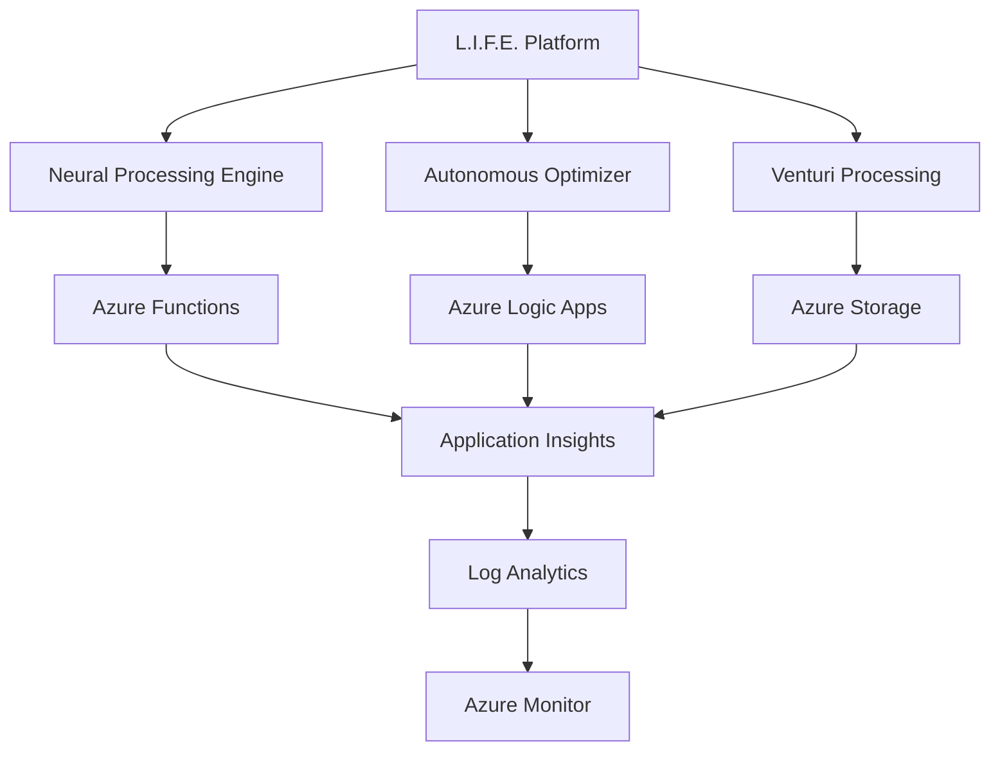

# L.I.F.E. Platform - Azure Ecosystem Review & Project Overview

## Executive Summary

This document provides a comprehensive overview of the L.I.F.E. (Learning Individually from Experience) Platform Azure ecosystem review task, current status, challenges encountered, and recommended next steps for Azure deployment and governance.

**Date**: September 9, 2025  
**Project**: SergiLIFE-life-azure-system  
**Repository**: SergiLIFE/SergiLIFE-life-azure-system  
**Branch**: main  

## Project Context

### L.I.F.E. Platform Overview

The L.I.F.E. Platform is an advanced autonomous optimization system featuring:

- **Neural Processing**: Adaptive pattern recognition and cognitive behavioral modeling
- **Real-time Processing**: EEG signal processing and Venturi harmonic calibration
- **Autonomous Optimization**: Self-optimizing algorithms with continuous learning
- **Azure Integration**: Cloud-native deployment with enterprise-grade governance

### Current Platform Components

- `autonomous_optimizer.py` - Core autonomous optimization engine
- `model_optimizer.py` - Neural model optimization suite
- `venturi_batching.py` - Canonical Venturi harmonic processing
- `azure_functions_workflow.py` - Azure Functions integration
- `azure_config.py` - Azure deployment configuration
- Comprehensive test suites and CI/CD workflows

## Azure Subscription Details

**Subscription Information:**

- **Subscription ID**: `5c88cef6-f243-497d-98af-6c6086d575ca`
- **Directory**: Sergio Paya Borrull (lifecoach-121.com)
- **Your Role**: Account Admin
- **Offer Type**: Azure Sponsorship
- **Offer ID**: MS-AZR-0036P
- **Parent Management Group**: `e716161a-5e85-4d6d-82f9-96bcdd2e65ac`

**Azure Sponsorship Benefits:**

- Monthly credit allocation for learning and development
- Access to most Azure services for educational/experimental purposes
- Suitable for proof-of-concept and development workloads
- Cost management is critical due to credit limitations

## Azure Ecosystem Review Status

### Attempted Actions

1. **Resource Inventory Query**: Attempted to retrieve comprehensive Azure resource information
2. **Subscription Analysis**: Tried to map subscription resources, resource groups, and governance policies
3. **Best Practices Retrieval**: Successfully gathered Azure governance and deployment guidelines

### Current Challenges

#### 1. Access Permissions (Primary Blocker)

**Status**: ❌ **BLOCKED**  
**Issue**: Azure Resource Graph query returned 403 Forbidden

```text
Error: AccessDenied
Timestamp: 2025-09-09T12:00:05.0204871Z
CorrelationId: 9ba63d66-2721-4172-9e71-96bd35ad27a8
Message: Access is denied to the requested resource. The user might not have enough permission.
```

**Root Cause**: Insufficient permissions to query Azure Resource Graph for subscription-wide resource inventory.

**Required Permissions**:

- `Reader` role on subscription or resource groups
- `Resource Graph Reader` role for Azure Resource Graph queries
- Potentially `Monitoring Reader` for metrics and diagnostics

#### 2. Logic Apps Extension Issues (RESOLVED ✅)

**Previous Issue**: Azure Logic Apps Standard extension dependency installation failing with EPERM errors
**Solution Applied**: Configured VS Code settings to redirect dependency installation to correct user profile path
**Status**: ✅ **RESOLVED**

## Azure Best Practices Framework

### Security & Authentication

- ✅ **Managed Identity**: Prefer managed identity over key-based authentication
- ✅ **Key Vault Integration**: Never hardcode credentials
- ✅ **Least Privilege**: Implement RBAC with minimal required permissions
- ✅ **Encryption**: Enable encryption in transit and at rest

### Infrastructure as Code (IaC)

- ✅ **Bicep Preferred**: Use Bicep templates over PowerShell/CLI scripts
- ✅ **File Organization**: Place Bicep files under `infra/` directory
- ✅ **Resource Separation**: Separate concerns by resource type and environment
- ✅ **Version Control**: All IaC files in source control with proper branching

### Deployment Strategy

- ✅ **Azure Developer CLI**: Prefer `azd` commands over individual `az` commands
- ✅ **Preview Deployments**: Always use `--preview` or `what-if` before deployment
- ✅ **Environment Isolation**: Separate dev/staging/production environments
- ✅ **Continuous Deployment**: Implement proper CI/CD pipelines

### Performance & Reliability

- ✅ **Connection Pooling**: Implement for database connections
- ✅ **Retry Logic**: Exponential backoff for transient failures
- ✅ **Circuit Breakers**: Prevent cascade failures
- ✅ **Monitoring**: Comprehensive logging and telemetry

## Recommended Next Steps

### Immediate Actions (Priority 1)

#### 1. Resolve Azure Access Permissions

```powershell
# Check current user and role assignments
az account show
az role assignment list --assignee $(az account show --query user.name -o tsv)

# Request necessary permissions from Azure administrator
# Required roles:
# - Reader (subscription or resource group level)
# - Resource Graph Reader
```

#### 2. Manual Resource Inventory (Fallback)

If permissions cannot be granted immediately, collect resource information manually:

```powershell
# Basic subscription information
az account show --output table

# List all resource groups
az group list --output table

# List resources by type
az resource list --query "[].{Name:name, Type:type, ResourceGroup:resourceGroup, Location:location}" --output table

# List storage accounts
az storage account list --output table

# List function apps
az functionapp list --output table

# List logic apps
az logic workflow list --output table
```

#### 3. Document Current Azure Estate

Create detailed inventory including:

- **Subscription Details**: Name, ID, tenant, quotas
- **Resource Groups**: Organization, naming conventions, purpose
- **Compute Resources**: VMs, Function Apps, Logic Apps, Container Instances
- **Storage Resources**: Storage accounts, blob containers, file shares
- **Networking**: VNets, subnets, NSGs, load balancers
- **Security**: Key Vaults, managed identities, RBAC assignments
- **Monitoring**: Application Insights, Log Analytics workspaces

### Short-term Goals (2-4 weeks)

#### 1. Infrastructure Standardization

- ✅ Create standardized Bicep templates for L.I.F.E. Platform components
- ✅ Implement naming conventions and tagging strategy
- ✅ Establish environment-specific parameter files
- ✅ Set up resource group organization

#### 2. CI/CD Pipeline Enhancement

- ✅ Implement Azure DevOps or GitHub Actions workflows
- ✅ Add infrastructure validation and testing
- ✅ Set up automated deployment gates
- ✅ Configure environment promotion workflows

#### 3. Security Hardening

- ✅ Implement comprehensive RBAC strategy
- ✅ Enable Azure Security Center recommendations
- ✅ Set up Key Vault for secrets management
- ✅ Configure network security groups and private endpoints

### Medium-term Objectives (1-3 months)

#### 1. Platform Optimization

- ✅ Implement auto-scaling for Function Apps
- ✅ Optimize storage tier configurations
- ✅ Set up comprehensive monitoring and alerting
- ✅ Implement cost optimization strategies

#### 2. Disaster Recovery & Business Continuity

- ✅ Design and implement backup strategies
- ✅ Set up geo-redundant storage where appropriate
- ✅ Create disaster recovery procedures
- ✅ Test recovery scenarios regularly

#### 3. Governance & Compliance

- ✅ Implement Azure Policy for governance
- ✅ Set up cost management and budgets
- ✅ Establish compliance monitoring
- ✅ Create operational runbooks

## Technical Architecture

### Current Platform Stack



### Recommended Azure Services

- **Compute**: Azure Functions (Flex Consumption), Logic Apps Standard
- **Storage**: Azure Blob Storage (Hot/Cool tiers), Azure Files
- **Database**: Azure Cosmos DB (for document storage), Azure SQL (for relational data)
- **Monitoring**: Application Insights, Log Analytics, Azure Monitor
- **Security**: Azure Key Vault, Managed Identity, Azure Security Center
- **Networking**: Virtual Network, Application Gateway, Azure CDN

## Cost Optimization Strategy

### Current Considerations

1. **Right-sizing**: Match compute resources to actual workload requirements
2. **Storage Tiers**: Use appropriate storage tiers based on access patterns
3. **Reserved Capacity**: Consider reserved instances for stable workloads
4. **Auto-scaling**: Implement intelligent scaling based on demand
5. **Resource Tagging**: Enable detailed cost allocation and tracking

### Budget Recommendations

- Set up budget alerts at 50%, 80%, and 100% thresholds
- Implement cost anomaly detection
- Regular cost reviews and optimization
- Consider Azure Hybrid Benefit for Windows workloads

## Security & Compliance Framework

### Security Baseline

- ✅ Enable Azure Security Center Standard tier
- ✅ Implement network segmentation with NSGs
- ✅ Use Azure AD integration for all services
- ✅ Enable encryption at rest and in transit
- ✅ Regular security assessments and updates

### Compliance Requirements

- Data residency and sovereignty considerations
- GDPR compliance for EU data
- Industry-specific compliance requirements
- Regular compliance audits and reporting

## Monitoring & Observability

### Key Metrics to Track

- **Performance**: Response times, throughput, error rates
- **Resource Utilization**: CPU, memory, storage, network
- **Business Metrics**: Processing accuracy, optimization improvements
- **Security**: Authentication failures, access patterns, security alerts

### Alerting Strategy

- Critical alerts: Service outages, security incidents
- Warning alerts: Performance degradation, resource constraints
- Info alerts: Deployment completions, scaling events

## Conclusion

The L.I.F.E. Platform represents a sophisticated autonomous optimization system with significant potential for Azure cloud deployment. While current access limitations prevent immediate comprehensive ecosystem review, the established framework and best practices provide a solid foundation for future Azure integration.

**Key Success Factors**:

1. **Resolve Azure access permissions** to enable comprehensive resource inventory
2. **Implement Infrastructure as Code** with Bicep templates
3. **Establish robust CI/CD pipelines** for automated deployment
4. **Maintain security-first approach** with comprehensive RBAC and encryption
5. **Optimize for cost and performance** through proper resource sizing and monitoring

**Next Review Date**: September 16, 2025 (or upon resolution of access permissions)

---

*This document serves as a living reference for the L.I.F.E. Platform Azure ecosystem management and should be updated as the project evolves and access issues are resolved.*
 file 